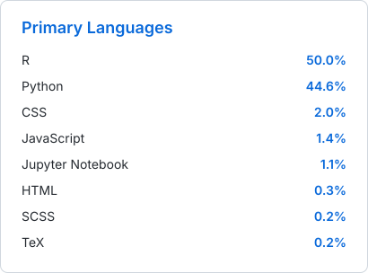
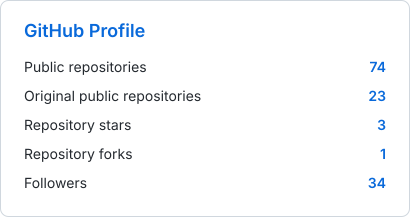

<h2 align="center">Marine Quantitative Ecologist & Fisheries Scientist</h2>

  I develop and integrate statistical, computational and ecological approaches to assess marine populations, fisheries and ecosystem change. My work combines stock assessment, spatio-temporal modelling, population and community dynamics, life-history theory, environmental information and multidimensional indicators to quantify uncertainty, diagnose changes in stock condition and support adaptive, ecosystem-based decision-making. I focus on small pelagic fish and Eastern Boundary Upwelling Systems (EBUS), while developing transferable methods for highly variable and data-limited marine systems.

  For research collaboration, scholarships or recruitment: <a href="mailto:qselmers@gmail.com"><strong>qselmers@gmail.com</strong></a>

  

  
  
  
  
  
  
  

  
  

## Research focus

- Quantitative marine ecology, fisheries science and stock assessment.
- Population and community dynamics, recruitment, growth and life-history variation.
- Spatio-temporal modelling, statistical ecology and marine ecosystem indicators.
- Small pelagic fish and ecological responses within Eastern Boundary Upwelling Systems.
- Multivariate stock-state diagnostics, thresholds, regime shifts and pressure–state relationships.
- Integration of biological, fishery and environmental evidence for adaptive management advice.
- Reproducible scientific workflows in R, Python, C++, Julia, Git and GitHub.

## Scientific software and educational projects

**Access legend:** 🔓 public repository · 🔒 private repository. The access status and main language are refreshed automatically from the GitHub API; the scientific purpose and development stage remain manually curated.

<!-- PROJECTS:START -->
### Scientific packages

| Access | Project | Purpose | Main language | Stage |
|---|---|---|---|---|
| 🔓 Public | [`seasignals`](https://github.com/qselmer/seasignals) | Detects and characterizes marine environmental signals, including ENSO-related phase, magnitude and temporal variability. | R | v0.1.0 · Active development |
| 🔓 Public | [`oceancube`](https://github.com/qselmer/oceancube) | Builds reproducible oceanographic data cubes for marine ecology, fisheries indicators, climatologies, anomalies and stock-oriented environmental analyses. | R | v0.0.0.9000 · Active development |

### Educational projects

| Access | Project | Purpose | Main language | Stage |
|---|---|---|---|---|
| 🔓 Public | [`R-LabCore`](https://github.com/qselmer/R-LabCore) | Reusable examples and learning workflows for scientific programming, statistical analysis and reproducible research in R. | R | Educational development |
| 🔓 Public | [`TMB-LabCore`](https://github.com/qselmer/TMB-LabCore) | Progressive examples for statistical modelling with Template Model Builder, automatic differentiation and R/C++ integration. | R / C++ | Educational development |
<!-- PROJECTS:END -->

## Recent publications

**Output legend:** 📄 published or publicly available scholarly output. Entries are generated in APA style from ORCID and, when a DOI exists, enriched with Crossref metadata. Titles remain plain text and the external link is placed at the end of each reference.

<!-- PUBLICATIONS:START -->
- 📄 **Quispe-Salazar, E.** (2026). Multivariate Health Index of the anchovy: Understanding the dynamics of small pelagic fish under environmental variability. *SPF-2026 Book of Abstracts: 2026 Small Pelagic Fish International Symposium*. [View presentation](https://meetings.pices.int/Publications/Presentations/2026-SPF/S1-May6-1720-Elmer-Ovidio-Salazar.mp4)
- 📄 **Quispe-Salazar, E.** (2026). Critical points of natural and anthropogenic pressures and responses in the state of the north–central anchovy stock in the pelagic system of the Peruvian sea. *SPF-2026 Book of Abstracts: 2026 Small Pelagic Fish International Symposium*. [View poster](https://meetings.pices.int/Publications/Presentations/2026-SPF/POSTER-S05-P19-Recoba-for-Salazar.pdf)
- 📄 **Quispe-Salazar, E.** (2025). Interannual variability in the growth of the Northern-Central stock of Peruvian anchovy (*Engraulis ringens*) during the period 1960–2022. *Cybertesis Revistas UNMSM Fondo editorial*. [View publication](https://zenodo.org/doi/10.5281/zenodo.17452484)
- 📄 **Quispe-Salazar, E.**, Sánchez, J., & Perea, Á. (2025). Classification models based on the gonadosomatic index to determine gonadal maturity stages: A case study in the Peruvian anchovy *Engraulis ringens*. *Scientia Marina*. [View publication](https://doi.org/10.3989/scimar.05636.117)
- 📄 **Quispe-Salazar, E.** (2024). Suitability of the gonadosomatic index in Peruvian Anchoveta (*Engraulis ringens*): Sexual maturity, a 5% critical threshold, and seasonal variation. *VI Simpósio Ibero-Americano de Ecologia Reprodutiva, Recrutamento e Pesca*. [View output](https://www.researchgate.net/doi/10.13140/RG.2.2.32795.73767)
<!-- PUBLICATIONS:END -->

[View the complete publication record](https://qselmer.github.io/publications/)

## Current research pipeline

**Status legend:** 🔓 manuscript in preparation · 🔒 submitted or under review · 💻 planned study. This block is controlled through `assets/data/research-pipeline.json`, so working projects can be updated without modifying the automation code.

<!-- PIPELINE:START -->
- 🔓 **Quispe-Salazar, E.** (Manuscript in preparation). Multivariate Health Index of the anchovy: Understanding the dynamics of small pelagic fish under environmental variability. *Manuscript in preparation*. [View conference presentation](https://meetings.pices.int/Publications/Presentations/2026-SPF/S1-May6-1720-Elmer-Ovidio-Salazar.mp4)
- 🔓 **Quispe-Salazar, E.** (Manuscript in preparation). Critical points of natural and anthropogenic pressures and responses in the state of the north–central anchovy stock in the pelagic system of the Peruvian sea. *Manuscript in preparation*. [View poster](https://qselmer.github.io/talks/2026-05-08-critical-points-anchovy-stock)
- 💻 **Quispe-Salazar, E.** (Planned study). Operational patterns, fishing effort and catch composition of the purse-seine tuna fishery off Peru, 2010–2025. *Planned research article*. [View research projects](https://qselmer.github.io/projects/)
<!-- PIPELINE:END -->

## How this profile is automated

A scheduled GitHub Actions workflow maintains the profile each day and can also be executed manually:

1. **Publications:** ORCID provides the canonical list of scholarly works; DOI records are enriched through Crossref and rendered in APA style with my name highlighted in bold.
2. **Research pipeline:** planned, in-preparation and under-review manuscripts are read from `assets/data/research-pipeline.json`, keeping unpublished work under manual control.
3. **Featured projects:** the selected repositories are defined in `assets/data/featured-projects.json`; GitHub supplies their current visibility and primary language.
4. **Profile metrics:** the GitHub API recalculates repository statistics and language composition, then regenerates the two SVG cards stored in this repository.
5. **Synchronization:** the canonical publication JSON is used by my academic website, reducing duplicated manual updates between GitHub and the website.

## Scientific computing

  
  
  
  
  
  
  
  
  

## Collaboration and opportunities

I am open to international research collaboration, doctoral and postdoctoral opportunities, research-software projects, and quantitative work related to marine ecology, fisheries assessment and ecosystem-based management.

**Contact:** [qselmers@gmail.com](mailto:qselmers@gmail.com) · [qselmer.github.io/contact](https://qselmer.github.io/contact/)

---

 Automated daily with GitHub Actions using ORCID, Crossref and GitHub metadata, with manually curated controls for the research pipeline and featured projects.
