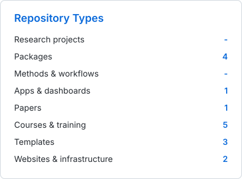
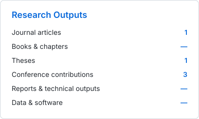
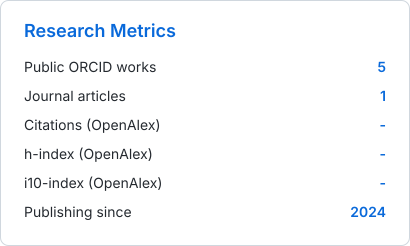

<h2 align="center">Marine Quantitative Ecologist & Fisheries Scientist</h2>

  I develop and integrate statistical, computational and ecological approaches to assess marine populations, fisheries and ecosystem change. My work combines stock assessment, spatio-temporal modelling, population and community dynamics, life-history theory, environmental information and multidimensional indicators to quantify uncertainty, diagnose changes in stock condition and support adaptive, ecosystem-based decision-making. I focus on small pelagic fish and Eastern Boundary Upwelling Systems (EBUS), while developing transferable methods for highly variable and data-limited marine systems.

  <strong>Currently seeking PhD opportunities internationally</strong> in quantitative marine ecology, fisheries science, ecological statistics, marine ecosystem modelling and reproducible scientific computing.

  For research collaboration, doctoral opportunities or recruitment: <a href="mailto:qselmers@gmail.com"><strong>qselmers@gmail.com</strong></a>

  

  
  
  
  
  
  
  

  
  

## Research focus

- 🐟 Quantitative marine ecology, fisheries science and stock assessment.
- 📈 Population and community dynamics, recruitment, growth and life-history variation.
- 🗺️ Spatio-temporal modelling, statistical ecology and marine ecosystem indicators.
- 🌊 Small pelagic fish and ecological responses within Eastern Boundary Upwelling Systems.
- 🧭 Multivariate stock-state diagnostics, thresholds, regime shifts and pressure–state relationships.
- 🧩 Integration of biological, fishery and environmental evidence for adaptive management advice.
- 💻 Reproducible scientific workflows in R, Python, C++, Julia, Git and GitHub.

## Research outputs & metrics

  
  

ORCID is the canonical source for the public scholarly-output record and output counts. DOI records are enriched with Crossref metadata. Citation count and h-index are refreshed from the ORCID-matched OpenAlex author record. Google Scholar remains linked above for profile discovery and citation browsing, but is not scraped by the automation.

## Research outputs

**Output legend:** 📄 journal article · 📝 preprint/working paper · 🎤 conference output · 📚 book/chapter · 🎓 thesis · 📋 report/technical output · 💾 data/software · 🔬 other research output. All public ORCID works are retained and classified; DOI records are enriched with Crossref metadata when available.

<!-- PUBLICATIONS:START -->
- 🎤 **Conference output** · **Quispe-Salazar, E.** (2026). Multivariate Health Index of the anchovy: Understanding the dynamics of small pelagic fish under environmental variability. *SPF-2026 Book of Abstracts: 2026 Small Pelagic Fish International Symposium*. [View output](https://meetings.pices.int/Publications/Presentations/2026-SPF/S1-May6-1720-Elmer-Ovidio-Salazar.mp4)
- 🎤 **Conference output** · **Quispe-Salazar, E.** (2026). Critical points of natural and anthropogenic pressures and responses in the state of the north--central anchovy stock in the pelagic system of the Peruvian sea. *SPF-2026 Book of Abstracts: 2026 Small Pelagic Fish International Symposium*. [View output](https://meetings.pices.int/Publications/Presentations/2026-SPF/POSTER-S05-P19-Recoba-for-Salazar.pdf)
- 🎓 **Thesis** · **Quispe-Salazar, E.** (2025). Interannual variability in the growth of the Northern-Central stock of Peruvian anchovy (Engraulis ringens) during the period 1960–2022. *Cybertesis Revistas UNMSM Fondo editorial*. [View output](https://zenodo.org/doi/10.5281/zenodo.17452484)
- 📄 **Journal article** · **Quispe-Salazar, E.**, Sánchez, J., & Perea, Á. (2025). Classification models based on the gonadosomatic index to determine gonadal maturity stages: a case study in the Peruvian anchovy Engraulis ringens. *Scientia Marina, 89*(4), e117. [View output](https://doi.org/10.3989/scimar.05636.117)
- 🎤 **Conference output** · **Quispe-Salazar, E.** (2024). Suitability of the gonadosomatic index in Peruvian Anchoveta (Engraulis ringens): Sexual maturity, a 5% critical threshold, and seasonal variation. *VI Simpósio Ibero-Americano de Ecologia Reprodutiva, Recrutamento e Pesca*. [View output](https://www.researchgate.net/doi/10.13140/RG.2.2.32795.73767)
<!-- PUBLICATIONS:END -->

[View the complete publication record](https://qselmer.github.io/publications/)

## Current research pipeline

**Status legend:** 🔓 manuscript in preparation · 🔒 submitted or under review · 💻 planned study. This block is controlled through `assets/data/research-pipeline.json`, so working projects can be updated without modifying the automation code.

<!-- PIPELINE:START -->
- 🔓 **Quispe-Salazar, E.** (Manuscript in preparation). Critical points of natural and anthropogenic pressures and responses in the state of the north–central anchovy stock in the pelagic system of the Peruvian sea. *Manuscript in preparation*. [View poster](https://qselmer.github.io/talks/2026-05-08-critical-points-anchovy-stock)
- 🔓 **Quispe-Salazar, E.** (Manuscript in preparation). Multivariate Health Index of the anchovy: Understanding the dynamics of small pelagic fish under environmental variability. *Manuscript in preparation*. [View conference presentation](https://meetings.pices.int/Publications/Presentations/2026-SPF/S1-May6-1720-Elmer-Ovidio-Salazar.mp4)
- 💻 **Quispe-Salazar, E.** (Planned study). Operational patterns, fishing effort and catch composition of the purse-seine tuna fishery off Peru, 2010–2025. *Planned research article*. [View research projects](https://qselmer.github.io/projects/)
<!-- PIPELINE:END -->

## Complete public repository portfolio

Every public repository owned by `qselmer` is inventoried automatically so the portfolio can be audited and cleaned systematically. Active original repositories are grouped by repository type; archived repositories and public forks are listed separately. Private repository names and metadata are never exposed. The summary cards above continue to use only active original public repositories so forks and archived material do not distort the PhD-facing portfolio metrics.

<!-- PROJECTS:START -->
**Inventory:** 84 public repositories · 22 active originals · 0 archived · 62 forks · 5 other/legacy.

### Packages (5)

| Repository | Description | Main language | Updated |
|---|---|---|---|
| [`fish-byte`](https://github.com/qselmer/fish-byte) | HTML, CSS y JavaScript. | CSS | 2025-03-05 |
| [`FisheryClose`](https://github.com/qselmer/FisheryClose) | — | R | 2025-04-28 |
| [`oceancube`](https://github.com/qselmer/oceancube) | — | R | 2026-08-20 |
| [`postHub`](https://github.com/qselmer/postHub) | — | R | 2025-05-03 |
| [`seasignals`](https://github.com/qselmer/seasignals) | — | R | 2026-02-06 |

### Apps & dashboards (1)

| Repository | Description | Main language | Updated |
|---|---|---|---|
| [`humboldt-ocean-watch`](https://github.com/qselmer/humboldt-ocean-watch) | AI-assisted daily sea surface temperature and thermal anomaly monitoring for the Niño 1+2 region. | Python | 2026-08-03 |

### Papers (1)

| Repository | Description | Main language | Updated |
|---|---|---|---|
| [`pelagicPER-availability-risk-paper`](https://github.com/qselmer/pelagicPER-availability-risk-paper) | — | — | 2026-08-07 |

### Courses & training (5)

| Repository | Description | Main language | Updated |
|---|---|---|---|
| [`ctd-C-plus-plus`](https://github.com/qselmer/ctd-C-plus-plus) | — | — | 2023-01-06 |
| [`R-LabCore`](https://github.com/qselmer/R-LabCore) | — | — | 2025-02-20 |
| [`skills-introduction-to-github`](https://github.com/qselmer/skills-introduction-to-github) | My clone repository | — | 2025-09-21 |
| [`TMB-LabCore`](https://github.com/qselmer/TMB-LabCore) | TMB-LabCore: A space dedicated to practicing, exploring, and developing skills in TMB programming. | TeX | 2025-02-21 |
| [`training_code_Python`](https://github.com/qselmer/training_code_Python) | training R, python, julia, C++ | Jupyter Notebook | 2024-02-10 |

### Websites & infrastructure (5)

| Repository | Description | Main language | Updated |
|---|---|---|---|
| [`.hub`](https://github.com/qselmer/.hub) | Repo for materials of NOAA git & Github training webinar April 2020 | R | 2026-07-24 |
| [`.template-fisheries-mse`](https://github.com/qselmer/.template-fisheries-mse) | — | Python | 2026-09-02 |
| [`qselmer`](https://github.com/qselmer/qselmer) | — | Python | 2026-09-05 |
| [`qselmer.github.io`](https://github.com/qselmer/qselmer.github.io) | Fisheries scientist & marine quantitative ecologist \| Stock assessment, spatio-temporal analytics, reproducible science | HTML | 2026-09-05 |
| [`template_summaryPDF`](https://github.com/qselmer/template_summaryPDF) | — | R | 2023-04-11 |

### Other / legacy (5)

These active repositories do not yet have a single defensible canonical `type-*` classification. Review, reclassify, archive or remove them as appropriate.

| Repository | Description | Main language | Updated |
|---|---|---|---|
| [`fisheries-research-workflows-book`](https://github.com/qselmer/fisheries-research-workflows-book) | Ecosistema digital para la ciencia pesquera y la ecología cuantitativa | SCSS | 2026-07-24 |
| [`prueba`](https://github.com/qselmer/prueba) | — | — | 2026-07-24 |
| [`r4fish`](https://github.com/qselmer/r4fish) | — | R | 2023-02-21 |
| [`TestPackage`](https://github.com/qselmer/TestPackage) | My R Package | R | 2020-09-13 |
| [`wk-esme`](https://github.com/qselmer/wk-esme) | — | — | 2023-01-09 |

### Forks (62)

Public forks are shown for cleanup visibility but are excluded from language and repository-type summary cards.

| Repository | Description | Main language | Updated |
|---|---|---|---|
| [`agricultural-monitoring-ftw`](https://github.com/qselmer/agricultural-monitoring-ftw) | This tutorial demonstrates how to generate field boundaries globally using the Fields of The World dataset, pretrained models, and command line interface (CLI). We then show how to use those boundaries in agricultural monitoring tasks under climate change, including crop type classification and forest loss monitoring. | — | 2026-07-27 |
| [`Anchovy_Spatial_Indicators`](https://github.com/qselmer/Anchovy_Spatial_Indicators) | Indicators found in Moron et al (2019) | — | 2020-12-10 |
| [`Aula-invertida`](https://github.com/qselmer/Aula-invertida) | Introducción al uso de software de código abierto aplicado al análisis de datos oceanográficos y gestión pesquera | — | 2022-12-06 |
| [`awesome-github-profile-readme-templates`](https://github.com/qselmer/awesome-github-profile-readme-templates) | This repository contains best profile readme's for your reference. | — | 2020-12-07 |
| [`bioacoustic-monitoring`](https://github.com/qselmer/bioacoustic-monitoring) | This tutorial presents an "agile modeling" approach that enables users to build custom classifier systems efficiently for species of interest using transfer learning, audio search, and human-in-the-loop active learning. | — | 2026-08-23 |
| [`book-1`](https://github.com/qselmer/book-1) | book | — | 2024-04-04 |
| [`bycatch`](https://github.com/qselmer/bycatch) | Data and R code for reproducing "Protecting marine mammals, turtles, and birds by rebuilding global fisheries". | — | 2023-11-15 |
| [`camels-hydrological-modeling`](https://github.com/qselmer/camels-hydrological-modeling) | A guide to model hydrological system using the real-world CAMELS dataset, which contains weather drivers for 531 basins across the continental United States. Through this modeling process, we will demonstrate various methods to predict streamflow, aiding in flood and drought planning. | — | 2026-07-30 |
| [`cc_trade`](https://github.com/qselmer/cc_trade) | climate change effects and trade implications | — | 2024-04-04 |
| [`citylearn`](https://github.com/qselmer/citylearn) | Learn how to design simple and advanced control algorithms to provide energy flexibility, and acquire familiarity with the CityLearn environment and its datasets for extended use in projects. The tutorial provides a walk-through on how to set up and interact with the environment using a real-world dataset in three hands-on control experiments. | — | 2026-07-30 |
| [`coal-power-mrv`](https://github.com/qselmer/coal-power-mrv) | Explore how to monitor coal power plant activity by leveraging satellite imagery and computer vision models. | — | 2026-08-23 |
| [`coastal-water-quality`](https://github.com/qselmer/coastal-water-quality) | Monitoring Coastal Water Quality and Marine Ecosystem Change Using Satellite Remote Sensing and Machine Learning | — | 2026-08-07 |
| [`CourseraLectures`](https://github.com/qselmer/CourseraLectures) | Lecture Materials for Coursera Courses by Roger Peng | — | 2022-08-19 |
| [`cy-user-examples`](https://github.com/qselmer/cy-user-examples) | Stock synthesis example models for users | — | 2022-03-24 |
| [`detect-deforestation`](https://github.com/qselmer/detect-deforestation) | Detecting Deforestation from Satellite Image Time Series | Jupyter Notebook | 2026-08-04 |
| [`downscaling-climate-projections`](https://github.com/qselmer/downscaling-climate-projections) | Statistical Downscaling of Climate Projections with Deep Learning | — | 2026-07-21 |
| [`examen-github`](https://github.com/qselmer/examen-github) | — | — | 2020-11-23 |
| [`Fishery-GPEDM`](https://github.com/qselmer/Fishery-GPEDM) | R and TMB examples for Fishery-centric Gaussian Process Empirical Dynamics Modelling | — | 2024-06-28 |
| [`FishLife`](https://github.com/qselmer/FishLife) | Estimate fish traits for all marine fish species globally | R | 2020-01-06 |
| [`FIT-binaries`](https://github.com/qselmer/FIT-binaries) | Legacy binaries from the original toolbox | — | 2025-02-26 |
| [`FITfileR`](https://github.com/qselmer/FITfileR) | R package for reading data from FIT files using only native R code, rather than relying on external libraries. | — | 2025-08-08 |
| [`flood-monitoring`](https://github.com/qselmer/flood-monitoring) | Floods in coastal areas can be extremely destructive natural hazards resulting in societal and economical damage. In this tutorial, explore how to predict building and population density to understand the potential impact from a flooding event. | — | 2026-08-23 |
| [`ggplot_adventcalendaR`](https://github.com/qselmer/ggplot_adventcalendaR) | A 25-day advent calendaR providing an introduction to ggplot2! | — | 2025-03-12 |
| [`hurricane-wind-var`](https://github.com/qselmer/hurricane-wind-var) | — | — | 2026-08-14 |
| [`icesSAG`](https://github.com/qselmer/icesSAG) | R interface to Stock Assessment Graphs database web services | — | 2023-01-23 |
| [`imarpe`](https://github.com/qselmer/imarpe) | imarpeTools | — | 2024-01-23 |
| [`intro-ai-tsunami-alerts`](https://github.com/qselmer/intro-ai-tsunami-alerts) | Introduction to AI - Predicting Tsunami Alerts from Earthquake Observations | — | 2026-07-24 |
| [`introduction-to-github`](https://github.com/qselmer/introduction-to-github) | Get started using GitHub in less than an hour. | — | 2025-09-21 |
| [`jack_mackerel`](https://github.com/qselmer/jack_mackerel) | Repository for joint jack mackerel model | — | 2020-12-21 |
| [`jjmr`](https://github.com/qselmer/jjmr) | R package for assessment model | — | 2022-07-06 |
| [`jjmTools`](https://github.com/qselmer/jjmTools) | Graphics and diagnostics libraries for SPRFMO's JJM model | — | 2023-06-29 |
| [`kali`](https://github.com/qselmer/kali) | Tools for habitat and niche modeling | — | 2023-07-12 |
| [`LBPA_r`](https://github.com/qselmer/LBPA_r) | Length-Based Pseudo-cohort Analysis (Package for R) | R | 2023-09-21 |
| [`lkotkote-bird-bioacoustics`](https://github.com/qselmer/lkotkote-bird-bioacoustics) | — | — | 2026-08-23 |
| [`ML4Oceans2022`](https://github.com/qselmer/ML4Oceans2022) | Slides and practicals for the ML4Oceans Summer School at Sorbonne Université, jointly supported by SCAI and the Institut de l'Océan | — | 2025-01-01 |
| [`mobility-demand`](https://github.com/qselmer/mobility-demand) | Ensuring a shared bike is readily available can reduce demand for less climate-friendly transportation options. Explore how to model the relationship between bike usage and points of interest (POIs) to identify the best locations for new shared-bike stands. | — | 2026-07-30 |
| [`mooc-machine-learning-weather-climate`](https://github.com/qselmer/mooc-machine-learning-weather-climate) | — | — | 2025-05-13 |
| [`optimal-power-flow`](https://github.com/qselmer/optimal-power-flow) | AC Optimal Power Flow (OPF) attempts to determine the setpoints of generators that would minimize the operating cost of a power system while meeting other operational constraints. In this tutorial, learn how to leverage PyTorch to train a neural network to approximate the optimal solutions. | — | 2026-08-14 |
| [`PDI_INIA_AGPRES_Python`](https://github.com/qselmer/PDI_INIA_AGPRES_Python) | Curso Análisis de procesamiento de imagenes multiespectrales RPAS con Python | — | 2022-11-23 |
| [`pel-climate-adaptive-management-paper`](https://github.com/qselmer/pel-climate-adaptive-management-paper) | Explore how Natural Language Processing (NLP) can be used to assist in identifying and mapping climate-relevant literature using a supervised learning approach and leverage a state of the art Large Language Model (LLM) to classify climate policy documents. | Jupyter Notebook | 2026-07-24 |
| [`PelagicosImarpe-Project-Lab-Report`](https://github.com/qselmer/PelagicosImarpe-Project-Lab-Report) | LaTeX projects de AFDPERP | — | 2022-12-07 |
| [`piggy-cast`](https://github.com/qselmer/piggy-cast) | This tutorial introduces PiggyCast, an ensemble machine learning model designed to improve weather prediction accuracy by stacking forecasts from various numerical, AI-based, and hybrid weather prediction models. | — | 2026-08-04 |
| [`quantmarineecolab.github.io`](https://github.com/qselmer/quantmarineecolab.github.io) | Lab website | — | 2024-04-04 |
| [`rajaprerak.github.io`](https://github.com/qselmer/rajaprerak.github.io) | Personal Portfolio Website | — | 2026-01-12 |
| [`RepData_PeerAssessment1`](https://github.com/qselmer/RepData_PeerAssessment1) | Peer Assessment 1 for Reproducible Research | — | 2017-05-15 |
| [`Report2_code_FisheriesEcologyandAssessment`](https://github.com/qselmer/Report2_code_FisheriesEcologyandAssessment) | — | — | 2021-05-04 |
| [`RFishBC`](https://github.com/qselmer/RFishBC) | This package helps fisheries scientists collect growth data from calcified structures and back-calculate estimated lengths at previous ages. The package is intended to replace much of the functionality provided by the now out-dated fishBC software. | R | 2018-11-30 |
| [`rw_maturity`](https://github.com/qselmer/rw_maturity) | Logistic age-based maturity model with time-varying a50 and slope parameters that are estimated as random effects and modeling using a random walk process.. | — | 2023-08-17 |
| [`sablefish_condition`](https://github.com/qselmer/sablefish_condition) | Sablefish condition indicators using length-weight residuals | — | 2023-08-17 |
| [`SAM`](https://github.com/qselmer/SAM) | Git page for SAM R-package | — | 2020-12-22 |
| [`shortspine_thornyhead_2023`](https://github.com/qselmer/shortspine_thornyhead_2023) | 2023 West Coast stock assessment for shortspine thornyhead | — | 2023-07-13 |
| [`spatial-bycatch`](https://github.com/qselmer/spatial-bycatch) | Which species distribution model best predicts fisheries bycatch? | — | 2020-11-23 |
| [`spict`](https://github.com/qselmer/spict) | Experimental fork of SPiCT with an observed monthly fishery-activity mask for structural zero catches. | — | 2026-07-18 |
| [`stat_rethinking_2022`](https://github.com/qselmer/stat_rethinking_2022) | Statistical Rethinking course winter 2022 | — | 2023-08-04 |
| [`StockAssessmentAnchovyPeruChile`](https://github.com/qselmer/StockAssessmentAnchovyPeruChile) | stock assessment outputs and final report for the shared anchovy stock between Peru and Chile | — | 2018-08-03 |
| [`SubsidyExplorer`](https://github.com/qselmer/SubsidyExplorer) | This repository contains all data and code underlying the SubsidyExplorer toolkit. The repositories for papers relevant to this project are linked within. | — | 2023-07-31 |
| [`template_reportPDF`](https://github.com/qselmer/template_reportPDF) | Template diseñado para generar un informe con formato utilizado por IFOP | — | 2023-04-05 |
| [`TropFishR`](https://github.com/qselmer/TropFishR) | Tropical Fisheries Analysis with R | — | 2024-07-18 |
| [`UTasIMAS_PhDThesis_Template`](https://github.com/qselmer/UTasIMAS_PhDThesis_Template) | A Latex template for a PhD thesis at the Institute for Marine and Antarctic Studies at the University of Tasmania. | — | 2023-07-11 |
| [`VME_Predictions_South_Pacific`](https://github.com/qselmer/VME_Predictions_South_Pacific) | R code used for predicting the distribution of VME indicator taxa for the manuscript titled “Presence-only habitat suitability models for Vulnerable Marine Ecosystem indicator taxa in the South Pacific have reached their predictive limit” authored by Fabrice Stephenson, Ashley A. Rowden, Owen F. Anderson, C. Roland Pitcher, Matt H. Pinkerton, Grad | — | 2023-06-22 |
| [`wg_MGWG`](https://github.com/qselmer/wg_MGWG) | ICES Methods Working Group | — | 2022-10-26 |
| [`wham`](https://github.com/qselmer/wham) | State-space, age-structured fish stock assessment model | — | 2022-11-03 |
<!-- PROJECTS:END -->

## How this profile is automated

A scheduled GitHub Actions workflow maintains the profile each week and can also be executed manually:

1. **Research outputs:** ORCID provides the canonical public scholarly record. Every public work is retained, classified by output type and rendered in the profile; DOI records are enriched through Crossref when available.
2. **Research metrics:** OpenAlex is matched strictly through the ORCID identifier and supplies citation count and h-index; the profile never relies on name-only author matching. Google Scholar is kept as a navigation link rather than an automated data source.
3. **Research pipeline:** planned, in-preparation and under-review manuscripts are read from `assets/data/research-pipeline.json`, keeping unpublished work under manual control.
4. **Complete repository inventory:** the GitHub API inventories every public repository owned by `qselmer`; active originals are grouped by repository type, while archived repositories and public forks remain visible in separate cleanup tables. Private repository metadata is never published.
5. **Repository summary cards:** language composition and repository-type counts use only active original public repositories, preventing forks and archived material from distorting the PhD-facing portfolio.
6. **Synchronization:** the canonical publication, metric and repository-catalog JSON files can be reused by my academic website, reducing duplicated manual updates between GitHub and the website.

## Scientific computing

  
  
  
  
  
  
  
  
  

## Collaboration and opportunities

I am open to international research collaboration, doctoral and postdoctoral opportunities, research-software projects, and quantitative work related to marine ecology, fisheries assessment and ecosystem-based management.

**Contact:** [qselmers@gmail.com](mailto:qselmers@gmail.com) · [qselmer.github.io/contact](https://qselmer.github.io/contact/)

---

 Automated weekly with GitHub Actions using ORCID, Crossref, OpenAlex and GitHub metadata, with manual control retained only for the research pipeline and legacy repository-type overrides.
